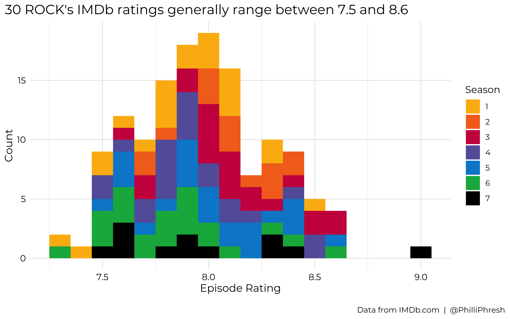
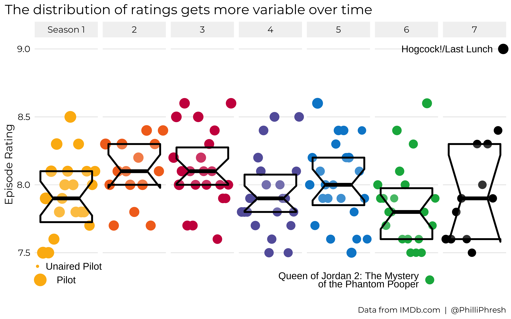
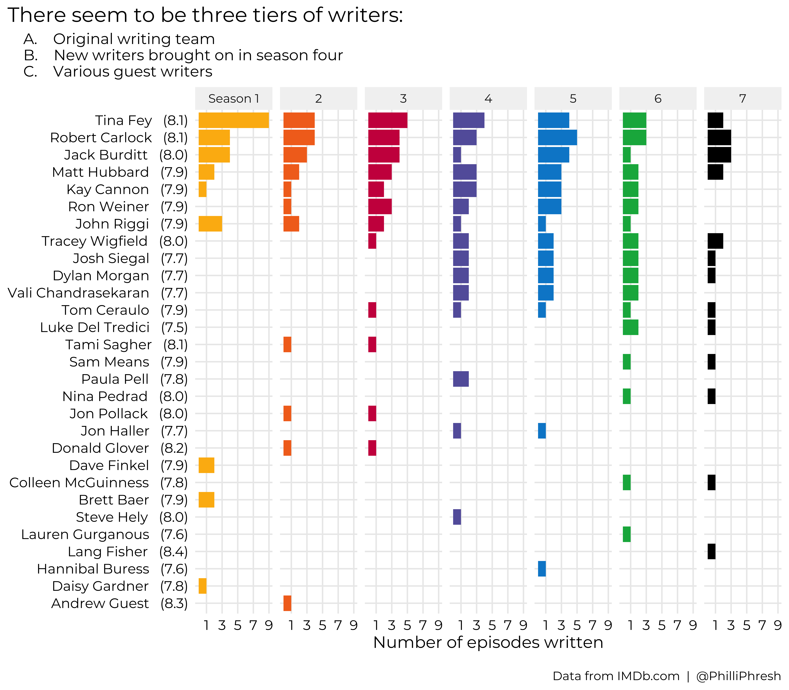

Analyzing 30 Rock Data
================
Phillip Sanderell

# Import data

# Exploring distributions of variables

## IMDb rating

<!-- -->

<!-- -->

## Prevalence of writers

I would like to see a plot of most common writers by season.

<!-- -->

Tina Fey clearly did not sleep, having had the highest number of
episodes written (or tied for) in five out of seven seasons, all while
staring in every episode. Robert Carlock wrote the second most total
episodes for the show, which is fortunate because I love his writing
style-quick, ridiculous, and too witty to keep up with sometimes. Tina
Fey and Robert Carlock went on to co-create *The Unbreakable Kimmy
Schmidt*, which would be another interesting show to analyze, bringing
along a lot of 30 Rock writing alumna. Tracy Wigfield created the NBC
series *Great News*, another great watch. I believe Donald Glover is
credited as a story consultant writer on some episodes that do not show
up here, but looks like he worked on the actual script for two episodes.

## Prevalence of directors

I would like to see a similar plot of most common directors by season.

<!-- -->

I wonder what happened to Adam Bernstein? He directed just as much as
Don Scardino in season one and then didn’t direct anymore. Jeff Richmond
directed a number of later episodes, avid watchers may recognize his
name as the composer for the series (or as Tina Fey’s husband in real
life). I notice Robert Carlock, the second-most credited writer,
directed an episode in the final season–I wonder if there is any other
writer/director overlap.
