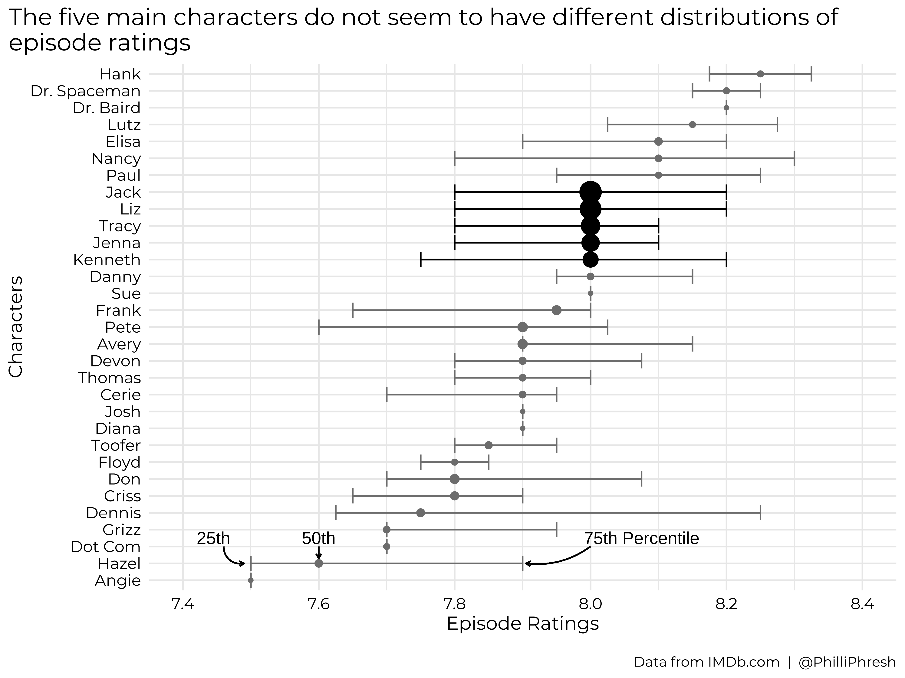

Analyzing 30 Rock Data
================
Phillip Sanderell

“Science is my most favorite subject, especially the Old Testament.”
Continuing my one-show streak of analyzing data for my favorite
television shows, I have chosen to explore Tina Fey’s *30 Rock*. In this
post I look forward to learning about what it takes to make a truly
fantastic show, and perhaps impress my friends from The Second City.

# Exploring episode metadata

## IMDb rating

IMDb ratings tend to be my go-to metric for scoring episodes, and
something that I find particularly interesting. I suppose I assume that
episodes with higher IMDb ratings had higher Neilsen ratings or
generated more audience for the show. The plot below shows the
distribution of IMDb ratings for every regular-season episode of the
show.

<!-- -->

The ratings do seem to have an approximately normal distribution
centered at eight stars. Something worth noting is that while IMDb
ratings range from 0 to 10, I find episode ratings for various shows
hover around 8 starts—perhaps there is some psychological reason for
that, but unfortunately we have no way of knowing, medicine is not a
science.

The plot above is useful for examining episode ratings overall, but it
is easy to tell if certain seasons rate better than others. The next
plot was made in an effort to make this more clear. Each dot represents
an episode going in order of air date from left to right, colored by
season, and sized by number of IMDb votes. The “notched” box plots show
the 25th, 50th, and 75th percentiles of ratings for each season—if the
notches in different season’s boxes don’t overlap, it suggests the
medians are significantly different.

<!-- -->

Based on the notched box plots, season six had a significantly lower
median rating than seasons two and three—perhaps that explains why
season seven is the last with only 12 episodes. NBC is quick to cancel
non-cop shows when they’re not doing well.

## Prevalence of writers

The plot below lists every writer of the show in order of total episodes
written for the series. The median IMDb rating for each writer’s
episodes is listed beside their name. Please note, on the full cast and
crew page for each episode, IMDb lists some people in the writing
credits section as ‘story editor’, ‘executive story editor’, etc., and
it always lists Tina Fey as ‘created by’. The counts in the plot below
only capture a writer if they are listed as ‘written by’.

<!-- -->

Tina Fey clearly did not sleep, having had the highest number of
episodes written (or tied for) in five out of seven seasons, all while
staring in every episode. Robert Carlock wrote the second most total
episodes for the show, which is fortunate because I love his writing
style: quick, ridiculous, and too witty to keep up with sometimes. Tina
Fey and Robert Carlock went on to co-create *The Unbreakable Kimmy
Schmidt*, which would be another interesting show to analyze, bringing
along a lot of 30 Rock writing alumna. Tracy Wigfield created the NBC
series *Great News*, another great watch. I believe Donald Glover is
credited as a story consultant writer on some episodes that do not show
up here, but looks like he worked on the actual script for two episodes.

## Prevalence of directors

The plot below lists every director of the show in order of total
episodes directed for the series. The median IMDb rating for each
director’s episodes is listed beside their name.

<!-- -->

I wonder what happened to Adam Bernstein? He directed just as much as
Don Scardino in season one and then didn’t direct anymore. Jeff Richmond
directed a number of later episodes, avid watchers may recognize his
name as the composer for the series (or as Tina Fey’s husband in real
life). I notice Robert Carlock, the second-most credited writer,
directed an episode in the final season—I wonder if there is any other
writer/director overlap.

## Examining characters listed in episode description

Can we find any relationships with character names?

### A little more web scraping needs performed to gather a list of character names

Looks good.

### Plotting character prevalence

Now that we have the top 50 character names, we can search for them in
the episode descriptions.

<!-- -->
